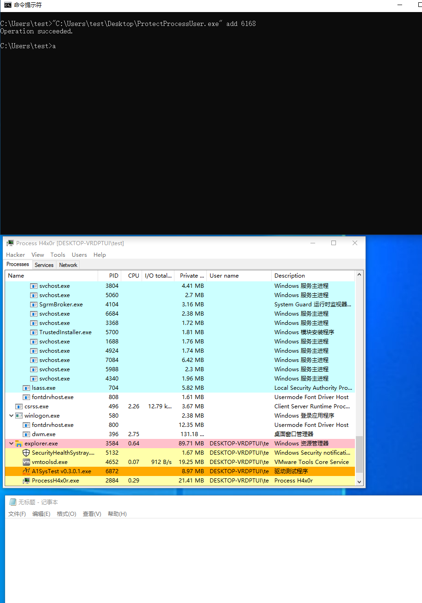

# ProtectYourProcess
​	保护进程不被关闭和不被枚举

​	作者：Sna1lGo

## 用法：

```
ProtectProcessUser [add | remove | clear] [pid] ...
```


## 示例： 

```
ProtectProcessUser.exe add 1048
```


## 效果图

​	在添加指定记事本进程（pid为1048）后，processHacker无法看到进程，且无法关闭该进程：


